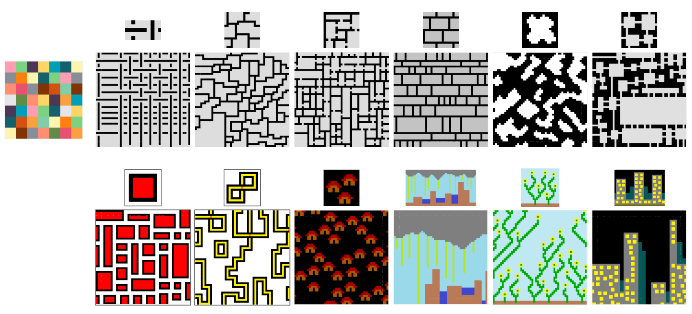
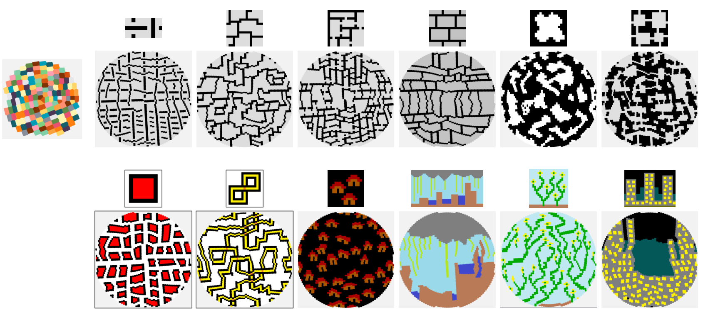
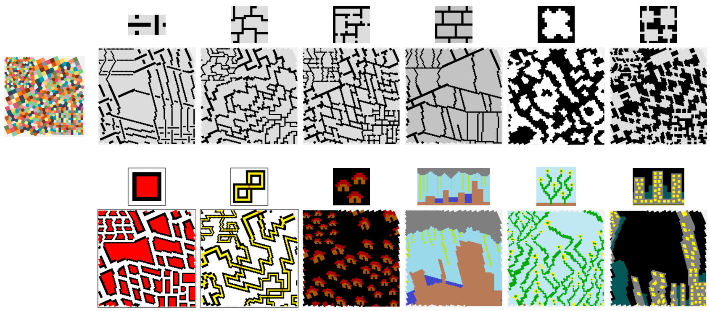
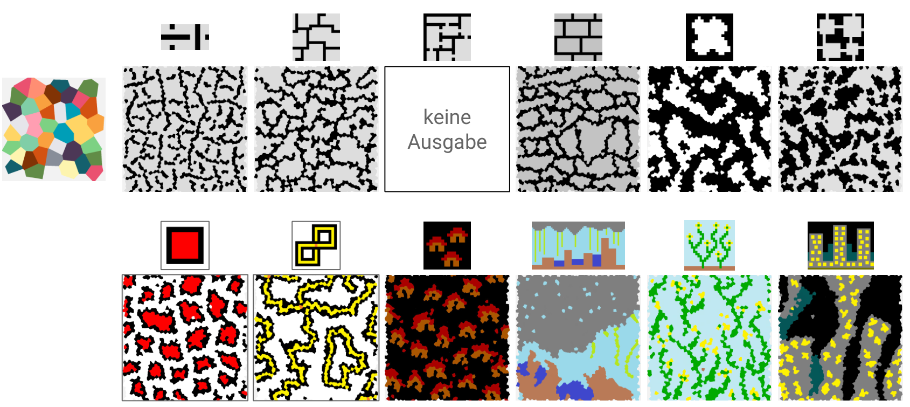

# Wave Function Collapse on Graphs

A procedural content generation application written in **Odin** that is based on the *Wave Function Collapse* by Maxim Gumin [WFC](https://github.com/mxgmn/WaveFunctionCollapse) to generate structured outputs from input examples. The application loads pattern examples (PNGs) from a directory and generates new outputs based on adjacency and pattern constraints.

The main difference is that you are not restricted to generating outputs on a grid. Before the shape of the input defined the shape of the output. This implementation cuts this dependency and allows you freedom in how to shape the output.

## Examples


### Overview with different kind of cell arrangements

On grid like graphs the output is the same quality as the original.


Irregularly arranged cells pose no problem.


You can make the graph complex, with different regions and complex edge-cases.


Even randomly placed cells, with different amount and distribution of neighbours can be used.


Though the larger or more complex the graph, the longer it may take to generate a complete output.
(See my paper(in german) for more in depth explanations and analysis)

## Features

This project:

* Implements a Wave Function Collapse–style generator on graph‑like structures.
* Generates new outputs based on constraints extracted from the example image.
* The algorithm can take any input image and any graph-structure, but output quality may suffer in some cases.

## Technical Information
* the program is written in [Odin](https://odin-lang.org/) and uses [Raylib](https://www.raylib.com/) to display and [DearImGUI](https://github.com/ocornut/imgui) for the ui.
* besides that is implemented from scratch
* 
* Odin compiler (>= version you use; add your version)
* Go through the provided build script or set up Odin environment

*(Optional: list OS compatibility or dependencies if there are any.)*

## Build & Run
If you feel brave, try if you can build and run it on your machine. No warranties.  

You will need to install the odin compiler.

Then setup the project.

```
git clone https://github.com/mrmetube/wfc
```

```
git submodule init
git submodule update --recursive
```

Build.
```
odin run build
```

Run the app.

```
.\build\wfc.exe .\data\images
```

### Usage 
The UI is rough, as I made in a way to help me develop. It is not polished for end-users, or more percisely I was the only intended end-user.

The *Extraction* UI lets you select the used image.  
In the *Grid* window you choose from some preset-graphs and adjust their size or parameters or below make your own.  
The *Generate* section lets you control the running generation, pause and resume and scroll back through the steps.  
The *Stats* and *Visual Options* show different information next to or on the graph.  
